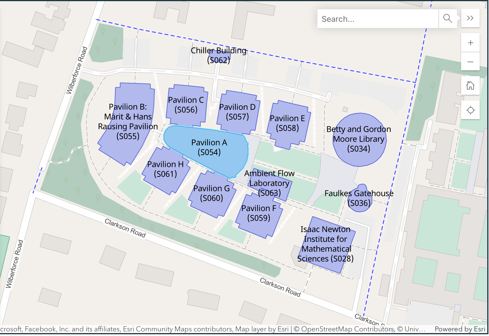

- [Accommodation](#Accommodation)
- [Campus Map](#Map)
- [Getting Here](#GettingHere)
- [Food](#Food)
- [Local Interest](#Local)
- [Pool and Gym](#Gym)

The UKI Discs Meeting 2026 will take place in **Meeting Room 2 (MR2)** at the Centre for Mathematical Sciences, Department of Applied Mathematics and Theoretical Physics, Wilberforce Rd, Cambridge CB3 0WA. [Map](https://www.cms.cam.ac.uk/how-find-us)]. 

The department is within walking distance of nearby Churchill College (5min), the Institute of Astronomy (12min), Westminster College (12min), and the city center (25min). 

The closest bus stop to the department is on Madingley Road: the stop is called **Storey's Way** and is located just to the east of the intersection between Storey's Way and Madingley Road. People arriving at Cambridge Station can take the **U1/U2/X3** bus from the station directly to Storey's Way (~26min). Note that most buses to/from the central station arrive/depart just south of the station (turn left after exiting the station).

## Accommodation {#Accommodation} 
Attendees are responsible for arranging their own accommodation. **We strongly recommend booking accommodation as soon as possible. July is a busy month in Cambridge (due to graduation, summer schools, and tourism), and prices tend to rise rapidly as summer approaches.** 

Below are some convenient options located within walking distance of the department:

- Churchill College: (~6min walk) [https://www.chu.cam.ac.uk/about/contact/](https://www.chu.cam.ac.uk/about/contact/)
- Westminster College: (~12min walk) [https://www.westminster.cam.ac.uk/about-us/contact-main](https://www.westminster.cam.ac.uk/about-us/contact-main)
- Lucy Cavendish College: (~12min walk) [https://www.lucy.cam.ac.uk/contact](https://www.lucy.cam.ac.uk/contact)
- Fitzwilliam College: (~8min walk) [https://www.fitz.cam.ac.uk/](https://www.fitz.cam.ac.uk/)
- Robinson College: (~13min walk) [https://www.robinson.cam.ac.uk/contact-us](https://www.robinson.cam.ac.uk/contact-us)
- Wolfson College: (~30min walk) [https://www.wolfson.cam.ac.uk/about/contact-us](https://www.wolfson.cam.ac.uk/about/contact-us)

Note that the city center (as measured from the Senate House) is also within walking distance (~25min) from DAMTP. 

<!--/*Student rooms are available on the de Havilland Campus at the University of Hertfordshire. These are a convenient and affordable option:
- **£70** per night (room only)  
- **£85** per night (room with breakfast<a href="#breakfast-note">[1]</a>)

Each room includes a wardrobe, desk, and a small ensuite bathroom, with access to a shared kitchen located on each corridor. Photos below show typical rooms and facilities, courtesy of UH Venues.

There are relatively few budget hotel options in Hatfield this year. The nearby Travelodge is charging slightly more than the student rooms. Other local hotels include the Premier Inn (fairly good value but not within easy walking distance) and the Comet Hotel, a luxury option very close to the venue.

  
  
  

[1] The prepaid breakfast option in the dining hall is only available on Tuesday 9th and Wednesday 10th. For those needing breakfast on Monday 8th, local options include the Sports Cafe on campus (limited selections) or the Wetherspoons close to campus for a full breakfast.
*/-->

## Campus Map {#Map}

The meeting will take place in Meeting Room (MR2) in Pavilion A (i.e. the _Central Core_) of the Centre for Mathematical Sciences.
There are three ways of accessing the central core (see map):
(i) from Wilberforce Road, 
(ii) (recommended if coming from the north) by entering past the Betty and Gordon Moore Library,
(iii) (recommended if coming from the south) following the footpath and entering through the Faulkes Gatehouse.
- after you enter the Central Core, the registration desk will be located immediately to the _right_.
- MR2 itself is located down the stairs immediately opposite the entrance to the Central Core.

## Getting Here {#GettingHere}
### *Arriving by train*
Cambridge has two train stations: Cambridge and Cambridge North. We strongly recommend arriving at **Cambridge**, which is located just 4km (2.5 miles) from DAMTP. The station sits on the Great Northern Line, with regular direct services from London Kings Cross, making it easily accessible from central London and surrounding areas.

From Cambridge Station, you can reach the department by bus (£3, 25 minutes) or by taxi/Uber (approximately £8–£12, 10-12 min) minutes):

**Bus**: the closest bus stop to the department (DAMTP) is on Madingley Road: the stop is called **Storey's Way** and is located just to the east of the intersection between Storey's Way and Madingley Road. People arriving at Cambridge Station can take the **U1/U2/X3** bus from the station directly to Storey's Way (~26min). Note that most buses to/from the central station arrive/depart just south of the station (turn left after exiting the station). Services run frequently on weekdays, with slightly reduced schedules during evenings and weekends. For live schedules and ticket info, visit the TBD Bus website.

**Taxis and Ubers**: there is a taxi-rank located just outside Cambridge station (immediately to the _right_ as you exit the station). A popular taxi service in Cambridge is Panther Taxis [https://www.panthertaxis.co.uk/](https://www.panthertaxis.co.uk/). Uber pick-up points are located in the parking lot just past the taxi-rank.

### *Arriving by (long-distance) coach*
You can travel to Cambridge from other parts of the UK by long-distance coach via **National Express** [https://www.nationalexpress.com/en](https://www.nationalexpress.com/en). Services stop at either **Parker's Piece** (near the centre of town) or **Madingley Park and Ride** in west Cambridge depending on the route. The latter is about a 21min walk from the department.

### *Arriving by car*
TBD

<!--For those wishing to park at the de Havilland campus, there is a large open air car park that you'll come into as you drive on to campus. It's marked **DH1** on the map here: [https://www.herts.ac.uk/__data/assets/pdf_file/0003/66774/campus-parking.pdf](https://www.herts.ac.uk/__data/assets/pdf_file/0003/66774/campus-parking.pdf)

The university charges £3/day (or free for the first 2 hours) with payment via **Hozah**. The procedure is to sign up once only at their website ([https://hozah.com/uhparking/](https://hozah.com/uhparking/)) providing your registration and payment details. Then everything is taken care of automatically, using automated number plate recognition to trigger payments. You can sign up before or after you arrive but **must do so by midnight on the day you first park**.

> **N.B.** After clicking "Pay as you go" on the website, **DO NOT CLICK THE BOX** asking  
> "Are you a Student?" — this refers to University of Hertfordshire students, who  
> are **not allowed** to park there.

Further details are at:  
[https://www.herts.ac.uk/contact-us/parking](https://www.herts.ac.uk/contact-us/parking)  
You can ignore the mention of residential parking information since that refers to UH students.-->

### *Arriving by plane*
Cambridge is relatively easy to reach from several London airports via public transport:

- From **Stansted Airport** (closest option):
      Train: direct trains from Stansted Airport to Cambridge.
      Bus: National Express from Stansted Airport to Parkers Piece, Cambridge.
- From **Gatwick Airport**:
      Train: take direct train from Gatwick through London to Cambridge.
- From **Heathrow Airport**:
      Train: take Piccadilly Underground line to King's Cross. Take train from King's Cross to Cambridge.
      Bus: take National Express from Heathrow Airport Terminal 5 to Parkers Piece, Cambridge.
- From **Luton Airport**: 
      Bus (recommended: take National Express from Luton to Cambridge Parkers Piece.

These routes offer convenient and cost-effective options for reaching Cambridge from London’s major airports.

## Food {#Food}

### *Lunch*
Lunch is included with the meeting registration. If you have any dietary requirements, please inform us when completing the registration form so that we can accommodate your needs.

### *Refreshments*
We will be providing refreshments (tea, coffee, fruit juice, water, biscuits) throughout the meeting. 

### *Dinner/Restaurants*

There are a plethora of restaurants near the city centre catering to all tastes and dietary requirements. More information to follow soon.

## Local Interest {#Local}
Coming soon.

## Access to Swimming Pool and Gym {#Gym}
**Gym/Climbing**:
- Parkside Pool and Gym (located on Parker's Piece, near the city center) [https://www.better.org.uk/leisure-centre/cambridge/parksidepools](https://www.better.org.uk/leisure-centre/cambridge/parksidepools)
- Kelsey Kerridge Sports Centre (located next to Parker's Piece) [https://kelseykerridge.co.uk/](https://kelseykerridge.co.uk/). _Gym and climbing_.
- Rainbow Rocket Central Climbing Centre (located next to the central train station) [https://rainbowrocket.cc/](https://rainbowrocket.cc/). _Climbing only_.
  
**Swimming**:
Two public swimming pools (both within walking disatnce of the city center) are:
- Parkside Pool and Gym (located on Parker's Piece, near the city center) [https://www.better.org.uk/leisure-centre/cambridge/parksidepools](https://www.better.org.uk/leisure-centre/cambridge/parksidepools). _Indoor only_.
- Jesus Green Lido (located on the river, just north of the city center) [https://jesusgreenlido.org/](https://jesusgreenlido.org/). _Outdoor only_. The UK's longest outdoor swimming pool!

 

